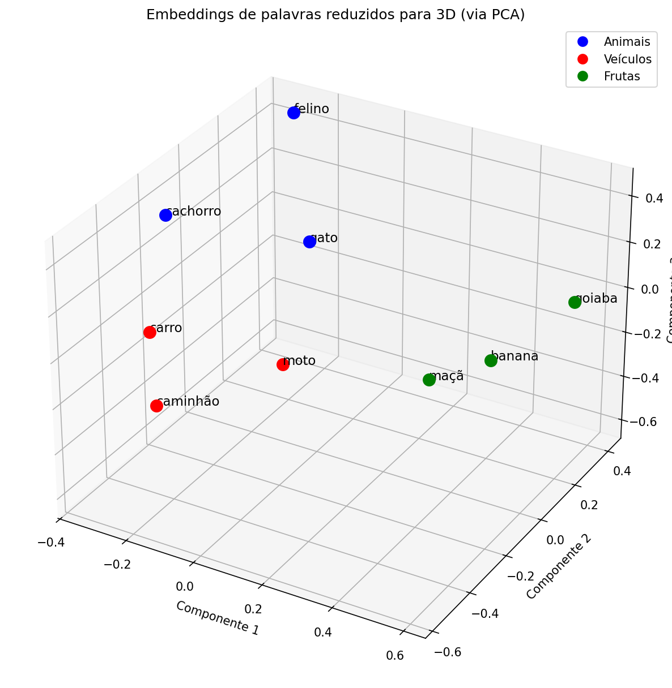

# Introducao a IA - Aula 03

Este projeto contem exercicios praticos sobre Embeddings - representacoes vetoriais de texto usadas em busca semantica e sistemas de Retrieval-Augmented Generation (RAG).

## Estrutura do Projeto

AULA_03/

├── README.md # Este arquivo

└── Aula_03_a.ipynb # Tarefas A e B: geracao/visualizacao de embeddings, distancias e busca semantica

## Passo a Passo para Configuracao e Execucao

### 1. Ativar o Ambiente Virtual

# No Linux/macOS

source venv/bin/activate

# No Windows

venv\Scripts\activate

### 2. Instalar as Dependencias

pip install openai scikit-learn matplotlib numpy pandas

## Tarefa A - Geracao e Visualizacao de Embeddings

Arquivo: Aula_03_a.ipynb

### Arquitetura do Codigo

┌─────────────────────────────────────────────┐

│ Aula_03_a.ipynb │

├─────────────────────────────────────────────┤

│ │

│ 1. Configuracao │

│ - client (OpenAI -> OpenRouter) │

│ │

│ 2. Funcoes │

│ - gerar_embedding() │

│ entrada: um texto │

│ saida: vetor + uso de tokens │

│ │

│ - gerar_embeddings_em_lote() │

│ entrada: lista de textos │

│ saida: vetores + tokens gastos │

│ (uma unica chamada a API) │

│ │

│ - gerar_embeddings_em_blocos() │

│ entrada: lista de textos + tamanho do bloco│

│ saida: vetores + tokens gastos │

│ (varias chamadas em lote, evitando │

│ estourar limite da API em textos grandes) │

│ │

│ - reducao via PCA (n_components=3) │

│ entrada: vetores (2048D) │

│ saida: coordenadas (3D) │

│ │

│ - plot 3D via matplotlib │

│ entrada: coordenadas + categorias │

│ saida: grafico 3D com legenda │

│ │

│ 3. Execucao │

│ palavras -> embeddings -> PCA -> grafico │

│ │

└─────────────────────────────────────────────┘

### Fluxo de dados

"gato", "carro", "banana"...

|

v

+--------------------+

| OpenRouter API | (nvidia/nemotron-3-embed-1b:free)

+--------------------+

|

v

Vetores 2048D

|

v

+--------------------+

| PCA | (reduz para 3 dimensoes)

+--------------------+

|

v

Coordenadas 3D

|

v

+--------------------+

| Matplotlib 3D | (grafico com legenda por categoria)

+--------------------+

### O que foi feito

1. Geracao de embeddings: utilizando o modelo gratuito nvidia/nemotron-3-embed-1b:free via OpenRouter, foram gerados vetores de 2048 dimensoes para 9 palavras de 3 categorias diferentes:

- Animais: gato, felino, cachorro

- Veiculos: carro, caminhao, moto

- Frutas: banana, maca, goiaba

2. Reducao de dimensionalidade: como nao e possivel visualizar 2048 dimensoes diretamente, foi utilizado o algoritmo PCA (Principal Component Analysis) para reduzir os vetores a 3 dimensoes, preservando ao maximo as relacoes de distancia entre eles.

3. Visualizacao 3D: os vetores reduzidos foram plotados em um grafico 3D, coloridos por categoria, permitindo observar visualmente como palavras de significado semelhante tendem a ficar mais proximas no espaco vetorial.

### Otimizacoes aplicadas

- Chamada unica a API: em vez de gerar um embedding por palavra (9 chamadas), todas as palavras foram enviadas em uma unica requisicao, reduzindo overhead de rede.

- Codigo modularizado em funcoes, com docstrings documentando parametros e retornos.

## Tarefa B - Distancias entre Embeddings

### Funcoes criadas

- `distancia_euclidiana(vec1, vec2)`: calcula a distancia euclidiana (norma L2 da diferenca) entre dois vetores.

- `similaridade_cosseno(vec1, vec2)`: calcula a similaridade de cosseno entre dois vetores.

- `distancia_cosseno(vec1, vec2)`: calcula 1 - similaridade de cosseno.

### Teste com vetores simples

Vetores `[1,0,0]`, `[0,1,0]` e `[1,0,0]` foram usados para validar as funcoes: vetores identicos resultam em distancia 0, e vetores ortogonais resultam em distancia de cosseno maxima (1.0).

### Teste com as 9 palavras da Tarefa A

Foi comparada a palavra "gato" contra todas as outras 8. Resultado (similaridade de cosseno, do mais proximo ao mais distante):

| Comparacao | Dist. Euclidiana | Sim. Cosseno |
|---|---|---|
| gato vs moto | 1.0782 | 0.5813 |
| gato vs cachorro | 1.0931 | 0.5974 |
| gato vs felino | 1.1179 | 0.6248 |
| gato vs carro | 1.1397 | 0.6495 |
| gato vs goiaba | 1.2193 | 0.7433 |
| gato vs caminhao | 1.2189 | 0.7428 |
| gato vs banana | 1.2584 | 0.7918 |
| gato vs maca | 1.2614 | 0.7955 |

**Observacao:** o modelo aproximou "gato" mais de "moto" do que de "felino" pela distancia de cosseno. Isso nao indica erro no calculo, mas sim uma limitacao esperada do modelo gratuito usado (`nemotron-3-embed-1b`) ao lidar com palavras isoladas, sem contexto de frase: sem frase ao redor, o modelo tende a capturar padroes estatisticos e de frequencia de uso, nao so significado semantico puro.

### Teste com frase ancora

Frase ancora: "O cachorro correu no parque e brincou com a bola."

| Frase de comparacao | Dist. Euclidiana | Sim. Cosseno | Dist. Cosseno |
|---|---|---|---|
| Similar (mesmo sentido, palavras diferentes) | 0.8465 | 0.6417 | 0.3583 |
| Oposto/Negacao | 0.9696 | 0.5299 | 0.4701 |
| Relacionado (mesmo contexto de animais) | 1.2289 | 0.2449 | 0.7551 |
| Diferente (outro dominio - economia) | 1.3641 | 0.0697 | 0.9303 |

**Observacoes:**

- A frase reformulada com o mesmo sentido ("Um cao estava correndo no jardim e brincando com seu brinquedo") ficou, como esperado, com a maior similaridade.

- A frase totalmente fora do dominio (juros do banco central) ficou com a menor similaridade, quase nula.

- Ponto de atencao: a frase de **negacao** ("Nenhum animal esteve no parque e o cao permaneceu preso em casa") ficou com similaridade maior do que a frase apenas "relacionada" (gato dormindo no